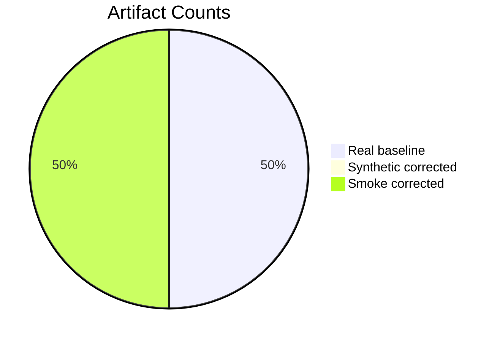
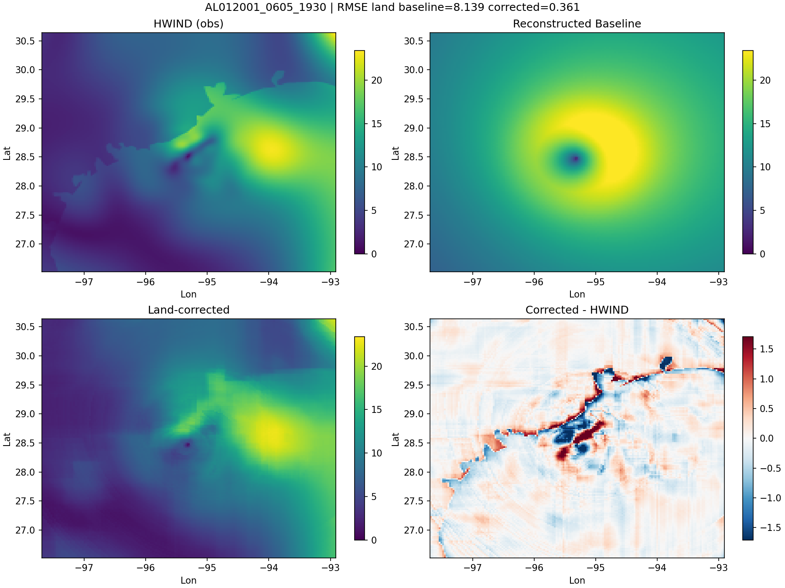

# TC Synthetic Project Dashboard

Last updated: **2026-04-16 23:18 UTC**

## Progress

| Item | Value |
|---|---:|
| Real baseline fields generated | 1 |
| Corrected synthetic fields | 0 |
| Smoke corrected fields | 1 |
| Latest artifact time | 2026-04-16 23:17 UTC |

### Artifact Overview

```mermaid
pie title Artifact Counts
    "Real baseline" : 1
    "Synthetic corrected" : 0
    "Smoke corrected" : 1
```

### Training Metrics

- `model_kind`: `hgbt`
- `n_pairs`: `1`
- `n_missed_pairs`: `1964`
- `n_samples`: `27885`
- `n_train`: `27885`
- `n_val`: `0`
- `train_rmse`: `0.36123000859155135`

## Results

Generated result samples: **1**

### AL012001_0605_1930

- Land RMSE baseline: `8.1389`
- Land RMSE corrected: `0.3612`
- RMSE improvement: `7.7776`

## Pipeline Paths

- Pipeline root: `/lustre/swx/users/3258/sandbox/synthetic_tc_downscale`
- Real baseline dir: `/lustre/swx/users/3258/sandbox/synthetic_tc_downscale/data/real_baseline_from_hwind`
- Model dir: `/lustre/swx/users/3258/sandbox/synthetic_tc_downscale/outputs/model`
- Corrected dir: `/lustre/swx/users/3258/sandbox/synthetic_tc_downscale/outputs/corrected`

